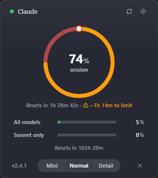
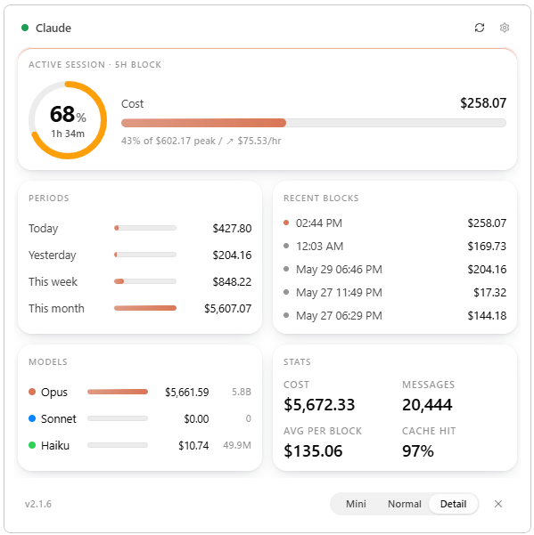
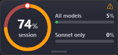

[English](README.md) | **한국어**

# Claude Usage Widget

**Claude Code**의 **Anthropic API 사용량**을 한눈에 보여주는 데스크탑 위젯 — 현재 세션, 주간 한도, 최근 블록, 모델별 비용까지. 브라우저나 콘솔 없이 화면 한 구석에서 확인. **Tauri 2 + SolidJS + Rust** 스택으로 처음부터 다시 만든 **Windows · macOS** 빌드.


> 이 프로젝트는 [INNO-HI/ClaudeUsageWidget](https://github.com/INNO-HI/ClaudeUsageWidget)을 기반으로 한 개인 프로젝트입니다. 원작자 [@khwee2000](https://velog.io/@khwee2000)의 양해를 구하여 공개합니다. 원본 저작권은 [INNO-HI](https://github.com/INNO-HI)에 있으며, 라이선스 조건은 [LICENSE](LICENSE)를 참고하세요. 전체 변경 내역은 [Releases](../../releases) 페이지에서.

Claude Code를 매일 사용하는 개발자를 위한 가벼운 데스크탑 도구. 대시보드를 열 필요 없이 화면 한 구석에 띄워두면 실시간으로 사용량을 보여줍니다.

---

## ✨ Features

### 3-모드 위젯
- **Mini** (240×112) — Donut + 2행 capsule. 최소 공간
- **Normal** (360×420) — Donut hero + 주간 capsule. 기본 모드
- **Detail** (600×680) — 4-카드 대시보드: 활성 세션, 기간별(오늘/어제/이번주/이번달), 최근 5h 블록, 모델별 사용량

푸터 SegmentedControl 또는 트레이 메뉴로 전환. 각 모드는 default size + minSize가 따로 있고, 드래그로 조정한 크기는 *모드별로 기억*됩니다.

### Liquid Glass + OS 네이티브 vibrancy
시스템 backdrop과 OS-level vibrancy 합성 — Windows는 **Win11 Mica/Acrylic**, macOS는 **NSVisualEffectView (HudWindow material)**. 배경 투명도 슬라이더는 *배경만* fade되고 텍스트·donut·게이지는 항상 불투명.

### 살아있는 트레이 아이콘
- Anthropic 픽셀 캐릭터 + radial halo
- halo 색은 threshold(녹/주/적, Apple stoplight)
- 4초 주기 호흡 효과 — Settings에서 토글 가능
- 캐릭터 외곽 1px 검은 stroke로 모든 배경에서 contrast 보장
- 연결 오류 시: halo가 중성 회색 + 우상단 빨간 status dot

### 자동 업데이트
부팅 3초 후 silent check + Settings 수동 버튼. 업데이트 있으면 톱니바퀴에 점 뱃지 + 백그라운드 다운로드 + 완료 시 "지금 재시작" 버튼. `tauri-plugin-updater`로 서명 매니페스트 검증.

### OAuth 토큰 자동 회복
플랫폼 네이티브 저장소에서 Claude Code OAuth 토큰을 읽음 — Windows는 `~/.claude/.credentials.json`, macOS는 **로그인 Keychain** (`Claude Code-credentials` 서비스). 만료 시 위젯 내 banner로 `claude` 실행 안내 + 다음 sync에서 자동 복구.

### 한국어 / 영어
모든 텍스트(요일·AM/PM 포함) 즉시 전환.

### 진단 로그
Settings → "로그 폴더 열기" 버튼이 `widget.log`를 보여줌. 모든 sync·error·update·UI 동작이 timestamp와 함께 기록됨 — 버그 리포트 첨부용.

---

## 🚀 Installation & Usage

### Windows
1. **다운로드** — [Releases](../../releases) 탭에서 최신 `Claude Widget_X.Y.Z_x64-setup.exe`를 받습니다.
2. **설치** — 인스톨러를 더블클릭. Windows 10은 WebView2 Runtime이 자동 설치됩니다 (Windows 11은 기본 탑재).
3. **첫 실행 — SmartScreen 우회** — 본 프로그램은 개인 오픈소스 빌드로 인스톨러에 디지털 서명이 되어 있지 않아 Windows SmartScreen 경고가 표시될 수 있습니다. 악성코드가 아니므로 `추가 정보 → 실행`을 눌러 진행하시면 됩니다.
4. **실행** — PC에 [Claude Code](https://docs.anthropic.com/en/docs/agents-and-tools/claude-code/overview)가 1회 이상 로그인된 인증 정보(`~/.claude/.credentials.json`)가 필요합니다.

### macOS
1. **다운로드** — [Releases](../../releases) 탭에서 최신 `Claude Widget_X.Y.Z_aarch64.dmg`를 받습니다 (Apple Silicon).
2. **설치** — .dmg 더블클릭, `Claude Widget.app`을 `/Applications`로 드래그.
3. **첫 실행 — Gatekeeper 우회** — Apple Developer 인증서 없이 *ad-hoc 서명*된 빌드라 macOS가 첫 실행을 차단합니다 (*"Apple이 확인할 수 없습니다…"* 경고). 두 가지 방법:
   - **Finder에서 우클릭 → 열기** 후 다이얼로그에서 *열기* 클릭. 한 번 허용하면 이후 일반 실행 가능.
   - 또는 터미널 1회: `xattr -d com.apple.quarantine "/Applications/Claude Widget.app"`
4. **실행** — `claude` CLI가 저장한 OAuth 토큰을 macOS Keychain에서 자동으로 읽습니다. 이 Mac에서 Claude Code를 한 번이라도 사용했다면 추가 설정 없이 동작.

### 조작 (양 OS 공통)
- **모드 전환** — 푸터 SegmentedControl (Mini / Normal / Detail) 또는 트레이 우클릭 메뉴
- **이동** — 헤더 바 드래그 (Mini에선 비대화형 영역 드래그)
- **리사이즈** — 창 모서리/가장자리 드래그. 각 모드별 사이즈 기억
- **숨기기** — 푸터 `×` 클릭으로 트레이로 보냄. 트레이 좌클릭으로 복귀
- **종료** — 트레이 우클릭 → `Quit`
- **설정** — 헤더 `⚙` 버튼
- **자동 동기화** — Settings → Auto sync (`Off / 5m / 10m / 30m / 1h`, default `5m`).

<p align="center">
  
  &nbsp;
  
</p>
<p align="center">
  
</p>

> ⚠️ 본 위젯은 Claude Code의 OAuth 사용량 엔드포인트를 호출합니다. Anthropic 측에서 해당 엔드포인트가 변경되거나 정책이 바뀔 경우 동작이 멈출 수 있습니다.

---

## 🛠️ Build from Source

> v2.0+ 스택: **Tauri 2 + Rust + SolidJS + Vite + UnoCSS + Motion One**. 기존 PyQt6 코드는 `v1.5.1` 태그에 보존되어 있으며, 아래는 현재 `main` 브랜치 기준입니다.

사전 요구: Node ≥ 20, Rust 툴체인(`rustup`). 플랫폼별 추가:
- **Windows** — Microsoft C++ Build Tools ("Desktop development with C++" 워크로드). Windows 11에는 WebView2 런타임 기본 탑재, Windows 10은 인스톨러 부트스트래퍼가 자동 설치.
- **macOS** — Xcode Command Line Tools (`xcode-select --install`). DMG 첫 빌드 시 Terminal에 Finder Automation 권한 필요 (System Settings → Privacy & Security → Automation → Terminal → Finder). 자세한 setup은 [`docs/macos-setup.md`](docs/macos-setup.md) 참조.

```bash
# 1. 저장소 클론
git clone https://github.com/gnoeynij/Claude-Usage-Widget.git
cd Claude-Usage-Widget

# 2. 의존성 설치
npm install

# 3. 개발 실행
npm run tauri dev

# 4. 프로덕션 빌드
npm run tauri build

# 5. 산출물 (Windows)
#   src-tauri/target/release/bundle/nsis/Claude Widget_<ver>_x64-setup.exe  (권장)
#   src-tauri/target/release/claude-widget.exe                              (포터블)
#
# 5. 산출물 (macOS)
#   src-tauri/target/release/bundle/dmg/Claude Widget_<ver>_aarch64.dmg     (권장)
#   src-tauri/target/release/bundle/macos/Claude Widget.app                 (raw 번들)
```

> Tauri 번들러가 호스트 OS에 맞는 산출물을 자동 선택합니다 — Windows에서 빌드하면 NSIS 인스톨러, macOS에서 빌드하면 .app + .dmg.

---

## 📝 Change Log

### v2.0.x (Tauri 2 + SolidJS 라인)

- [**v2.0.3**](docs/release-notes/v2.0.3.md) — 설정 persist 회귀 해소 (lang / 다크 / opacity / sync / 항상 위 / 모드가 재시작 후에도 유지) + PyQt6 마이그레이션 정렬 + 트레이 메뉴 i18n (한/영) + 에러 배너 4종 확장 (TOKEN_EXPIRED / NO_CREDENTIALS / RATE_LIMITED / NETWORK).
- [**v2.0.2**](docs/release-notes/v2.0.2.md) — macOS 첫 정식 릴리즈 (vibrancy, Keychain credentials, drag region, DMG) + 검은 모서리 fix + Windows/macOS 자동 업데이트 통합 + Detail 모드 UX (시간당 비용, 모델별 토큰, drag overlay).
- [**v2.0.1**](docs/release-notes/v2.0.1.md) — 첫 공개 v2.0.x 릴리즈 (v2.0.0 은 internal cut), 서명 키 교체.
- [**v2.0.0**](docs/release-notes/v2.0.0.md) — *internal cut.* PyQt6 → Tauri 2 + SolidJS 전면 재작성. Liquid Glass + Win11 Mica/Acrylic, 3-mode 위젯 (Mini/Normal/Detail), 자동 업데이트, 트레이, OAuth 회복, en/ko 다국어.

전체 노트는 [Releases](../../releases) 페이지에서도 확인 가능.

### v1.5.1 (PyQt6 라인, legacy)
- 토큰 만료 처리 — `expiresAt` 사전 체크로 의미 없는 GET 스킵 + 401 응답 시 새 credentials 로 1회 자동 retry (Claude Code 가 sync 중 토큰을 갱신하는 race 대응)

v1.0.0 – v1.5.0 변경 내역은 [v1.5.1 태그 README](https://github.com/gnoeynij/Claude-Usage-Widget/blob/v1.5.1/README.md)에서 확인하세요.

---

## 📄 License

이 프로젝트는 [MIT License](LICENSE)를 따릅니다.

- 원본 저작권 © 2026 [INNO-HI](https://github.com/INNO-HI/ClaudeUsageWidget) — Original work
- 수정·추가 저작권 © 2026 choi jinyeong — Modifications and additional features

원작자에게 사전 양해를 구하고 공개되었습니다. MIT 라이선스의 저작권 고지 보존 조건에 따라 본 포크의 사용·수정·재배포가 자유롭습니다.

폰트: [SUIT](https://sun.fo/suit/) by Sun (SIL Open Font License). 픽셀 캐릭터 `src/assets/claude-header.png`는 Anthropic asset 으로 brand identity 표현에 사용됩니다.
