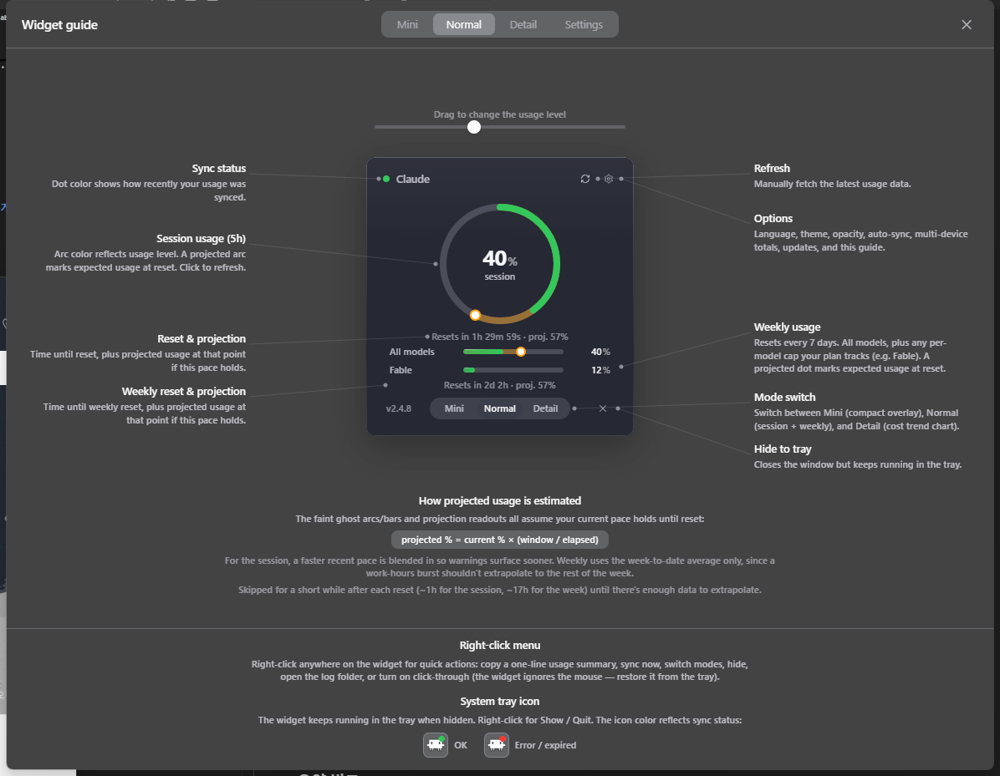
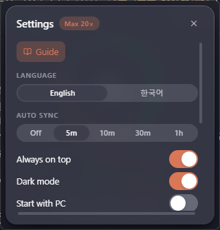
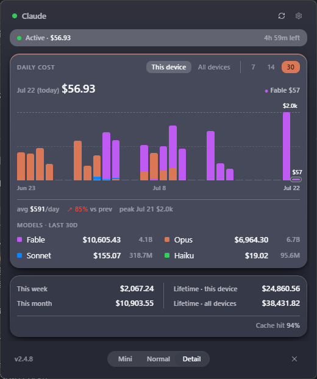
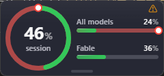

[English](README.md) | **한국어**

# Claude Usage Widget

**Claude Code**의 **Anthropic API 사용량**을 한눈에 보여주는 데스크탑 위젯 — 현재 세션, 주간 한도, 일별 비용 추세, 모델별 비용까지. 브라우저나 콘솔 없이 화면 한 구석에서 확인. **Tauri 2 + SolidJS + Rust** 스택으로 처음부터 다시 만든 **Windows · macOS** 빌드.


> 이 프로젝트는 [INNO-HI/ClaudeUsageWidget](https://github.com/INNO-HI/ClaudeUsageWidget)을 기반으로 한 개인 프로젝트입니다. 원작자 [@khwee2000](https://velog.io/@khwee2000)의 양해를 구하여 공개합니다. 원본 저작권은 [INNO-HI](https://github.com/INNO-HI)에 있으며, 라이선스 조건은 [LICENSE](LICENSE)를 참고하세요. 전체 변경 내역은 [Releases](../../releases) 페이지에서.

Claude Code를 매일 사용하는 개발자를 위한 가벼운 데스크탑 도구. 대시보드를 열 필요 없이 화면 한 구석에 띄워두면 실시간으로 사용량을 보여줍니다.

---

## ✨ Features

### 3-모드 위젯
- **Mini** (240×112) — Donut + 2행 capsule. 최소 공간
- **Normal** (320×360) — Donut hero + 주간 capsule. 기본 모드
- **Detail** (592×619, minSize 520×520) — 대시보드: 활성 세션(현재 5h 블록 — 비용 · 남은 시간 · 시간당 비용), 일별 비용 추세 차트(모델별 색, 7 / 14 / 30일 범위, 막대 클릭으로 날짜 선택, 기기 토글), 모델별 비용 내역(Opus · Fable · Sonnet · Haiku, 토큰 수 포함), 합계 카드(이번 주 / 달 · 기기별 & 전체 누적 · 캐시 적중률)

푸터 SegmentedControl 또는 트레이 메뉴로 전환. 각 모드는 default size + minSize가 따로 있고, 드래그로 조정한 크기는 *모드별로 기억*됩니다.

### 한도 투영
도넛과 주간 막대에 반투명 **고스트 아크·도트**가 겹쳐, 현재 속도가 유지될 때 초기화 시점의 예상 사용량을 표시하고 초기화 캡션에 예상치가 함께 나옵니다. 세션은 최근 속도가 더 빠르면 이를 반영해 경고가 더 일찍 나타나고, 주간은 업무시간 burst가 한 주 전체로 확대 적용되지 않도록 누적 평균만 사용합니다. 초기화 직후 잠시(데이터가 쌓일 때까지)는 표시하지 않습니다.

한도 도달이 예상되면 Mini에 **⚠ 위험 배지**(클릭 시 한도별 상세)가 뜨고 백그라운드에서 **트레이 알림**이 발생합니다. Mini 모드에는 헤더 상태 점이나 에러 배너가 없어, 이 배지가 동기화 실패(토큰 만료·자격 증명 없음·네트워크 끊김)도 함께 표시합니다 — 삼각형 대신 **빨간 ●**(속도 제한처럼 "곧 재시도"하는 차분한 경우는 파란색)으로 바뀌며, 클릭하면 에러 설명을 볼 수 있습니다.

### Liquid Glass + OS 네이티브 vibrancy
시스템 backdrop과 OS-level vibrancy 합성 — Windows는 **Win11 Mica/Acrylic**, macOS는 **NSVisualEffectView (HudWindow material)**. 배경 투명도 슬라이더는 *배경만* fade되고 텍스트·donut·게이지는 항상 불투명.

### 트레이 상태 표시
- Anthropic 캐릭터 + status dot — 마지막 sync 가 *정상*이면 **녹색**, *실패* (토큰 만료, 네트워크 차단, rate limit 등) 면 **빨간색**
- sync 마다 dot 이 즉시 갱신되어 위젯을 펼치지 않고도 정상 여부 확인 가능

### 자동 업데이트
부팅 3초 후 silent check + Settings 수동 버튼. 업데이트 있으면 톱니바퀴에 점 뱃지 + 백그라운드 다운로드 + 완료 시 "지금 재시작" 버튼. `tauri-plugin-updater`로 서명 매니페스트 검증.

### OAuth 토큰 자동 회복
플랫폼 네이티브 저장소에서 Claude Code OAuth 토큰을 읽음 — Windows는 `~/.claude/.credentials.json`, macOS는 **로그인 Keychain** (`Claude Code-credentials` 서비스). 만료 시 위젯이 스스로 복구합니다: 최소한의 Claude Code 호출을 조용히 실행해 CLI가 토큰을 갱신하게 만든 뒤 재동기화(만료 에피소드당 CLI 실행 1회 상한). 아예 로그아웃 상태면 배너의 **로그인 열기** 버튼이 터미널에서 `claude auth login` 브라우저 플로우를 실행합니다.

### 사용량 알림
- 5시간 세션 *또는* 7일 주간 한도의 **85%** · **95%** 도달 시 알림
- 위젯이 화면에 떠 있을 땐 **인앱 Liquid Glass 토스트**(위젯 미감과 일치, OS 권한 불필요), 트레이로 숨겼을 땐 **OS 알림**으로 폴백
- 블록당 임계치별 1회만 — 매 sync 반복 X. OS 권한은 트레이 숨김 상태 첫 도달 시 lazy 요청

### 누적 비용 & 기기 통합
- **누적 · 이 기기** — Claude Code 로그가 정리돼도 줄지 않는 running total (*현재 디스크* 값은 오래된 JSONL 세션이 삭제되며 내려갈 수 있지만, 누적은 한 번 집계한 비용을 유지)
- **누적 · 전체 기기** — 각 PC의 *기기 통합 누적* 설정을 같은 클라우드 동기화 폴더(OneDrive / iCloud / Dropbox / Google Drive)로 지정하면 모든 기기의 누적을 하나로 합산. 서버 없음 — 각 기기는 자기 파일만 쓰고 클라우드가 전파

### 실시간 카운트다운
세션 리셋과 활성 5시간 블록이 sync 사이에도 초 단위로 똑딱 카운트다운. (모든 비용은 로컬 추정치: `~/.claude/projects` JSONL × 공식 단가표.)

### 인터랙티브 위젯 가이드
**Settings → 가이드**를 누르면 별도 창에서 실제 위젯이 각 모드의 실제 크기로 렌더링되고, 사용량 슬라이더를 드래그해 안전→위험 상태를 직접 넘나들며 UI 변화를 확인할 수 있습니다. Mini · Normal · Detail · Settings 4개 탭에서 각 UI 요소에 측정 기반 콜아웃이 붙고, 예상 사용량 계산 방식 설명도 함께 제공됩니다.

<p align="center">
  
</p>

### 한국어 / 영어
모든 텍스트(요일·AM/PM 포함) 즉시 전환.

---

## 🚀 Installation & Usage

### Windows
1. **다운로드** — [Releases](../../releases) 탭에서 최신 `Claude Widget_X.Y.Z_x64-setup.exe`를 받습니다.
2. **설치** — 인스톨러를 더블클릭. Windows 10은 WebView2 Runtime이 자동 설치됩니다 (Windows 11은 기본 탑재).
3. **첫 실행 — SmartScreen 우회** — 본 프로그램은 개인 오픈소스 빌드로 인스톨러에 디지털 서명이 되어 있지 않아 Windows SmartScreen 경고가 표시될 수 있습니다. 악성코드가 아니므로 `추가 정보 → 실행`을 눌러 진행하시면 됩니다.
4. **실행** — PC에 [Claude Code](https://docs.anthropic.com/en/docs/agents-and-tools/claude-code/overview)가 1회 이상 로그인된 인증 정보(`~/.claude/.credentials.json`)가 필요합니다.

### macOS
1. **다운로드** — [Releases](../../releases) 탭에서 최신 `Claude Widget_X.Y.Z_aarch64.dmg`를 받습니다 (Apple Silicon).
2. **설치** — .dmg 더블클릭, `Claude Widget.app`을 `/Applications`로 드래그.
3. **첫 실행 — Gatekeeper 우회** — Apple Developer 인증서 없이 *ad-hoc 서명*된 빌드라 macOS가 첫 실행을 차단합니다 (*"Apple이 확인할 수 없습니다…"* 경고). 두 가지 방법:
   - **Finder에서 우클릭 → 열기** 후 다이얼로그에서 *열기* 클릭. 한 번 허용하면 이후 일반 실행 가능.
   - 또는 터미널 1회: `xattr -d com.apple.quarantine "/Applications/Claude Widget.app"`
4. **실행** — `claude` CLI가 저장한 OAuth 토큰을 macOS Keychain에서 자동으로 읽습니다. 이 Mac에서 Claude Code를 한 번이라도 사용했다면 추가 설정 없이 동작.

### 조작 (양 OS 공통)
- **모드 전환** — 푸터 SegmentedControl (Mini / Normal / Detail) 또는 트레이 우클릭 메뉴
- **이동** — 헤더 바 드래그 (Mini에선 비대화형 영역 드래그)
- **리사이즈** — 창 모서리/가장자리 드래그. 각 모드별 사이즈 기억
- **숨기기** — 푸터 `×` 클릭으로 트레이로 보냄. 트레이 좌클릭으로 복귀
- **종료** — 트레이 우클릭 → `Quit`
- **설정** — 헤더 `⚙` 버튼
- **테마·항상 위·자동 실행** — Settings → 다크/라이트 테마 + 다른 창 위에 고정하는 *항상 위* + PC 시작 시 자동 실행 토글
- **자동 동기화** — Settings → Auto sync (`Off / 5m / 10m / 30m / 1h`, default `5m`).

<p align="center">
  
  &nbsp;
  
</p>
<p align="center">
  
</p>

> ⚠️ 본 위젯은 Claude Code가 로컬에 저장한 OAuth 토큰(Windows/Linux는 `~/.claude/.credentials.json`, macOS는 로그인 키체인)을 재사용해 Anthropic의 OAuth 사용량 엔드포인트를 호출합니다. Anthropic Consumer 약관(2026-02-19 갱신)은 Claude Free/Pro/Max 계정의 OAuth 토큰을 Claude Code·claude.ai 외의 도구에서 쓰는 것을 허용하지 않는다고 명시합니다 — 따라서 이 읽기 전용 재사용은 비공식·best-effort 방식이며 일부 계정·약관 리스크가 있고, Anthropic 이 엔드포인트를 바꾸거나 정책을 집행하면 동작이 멈출 수 있습니다. 사용 여부는 본인 판단에 따르세요.

---

## 🛠️ Build from Source

> v2.0+ 스택: **Tauri 2 + Rust + SolidJS + Vite + UnoCSS + Motion One**. 기존 PyQt6 코드는 `v1.5.1` 태그에 보존되어 있으며, 아래는 현재 `main` 브랜치 기준입니다.

사전 요구: Node ≥ 20, Rust 툴체인(`rustup`). 플랫폼별 추가:
- **Windows** — Microsoft C++ Build Tools ("Desktop development with C++" 워크로드). Windows 11에는 WebView2 런타임 기본 탑재, Windows 10은 인스톨러 부트스트래퍼가 자동 설치.
- **macOS** — Xcode Command Line Tools (`xcode-select --install`). DMG 첫 빌드 시 Terminal에 Finder Automation 권한 필요 (System Settings → Privacy & Security → Automation → Terminal → Finder). 자세한 setup은 [`docs/macos-setup.md`](docs/macos-setup.md) 참조.

```bash
# 1. 저장소 클론
git clone https://github.com/gnoeynij/Claude-Usage-Widget.git
cd Claude-Usage-Widget

# 2. 의존성 설치
npm install

# 3. 개발 실행
npm run tauri dev

# 4. 프로덕션 빌드
npm run tauri build

# 5. 산출물 (Windows)
#   src-tauri/target/release/bundle/nsis/Claude Widget_<ver>_x64-setup.exe  (권장)
#   src-tauri/target/release/claude-widget.exe                              (포터블)
#
# 5. 산출물 (macOS)
#   src-tauri/target/release/bundle/dmg/Claude Widget_<ver>_aarch64.dmg     (권장)
#   src-tauri/target/release/bundle/macos/Claude Widget.app                 (raw 번들)
```

> Tauri 번들러가 호스트 OS에 맞는 산출물을 자동 선택합니다 — Windows에서 빌드하면 NSIS 인스톨러, macOS에서 빌드하면 .app + .dmg.

---

## 📝 Change Log

### v2.0.x (Tauri 2 + SolidJS 라인)

- [**v2.4.7**](docs/release-notes/v2.4.7.md) — 설정에 "PC 시작 시 자동 실행" 토글 추가: OS 레벨 로그인 항목(Windows HKCU Run 레지스트리, macOS LaunchAgent)을 등록해 로그인 시 위젯이 자동 실행됩니다. 기본 OFF, OS 항목이 진실의 출처라 스위치가 항상 실제 상태를 반영합니다.
- [**v2.4.6**](docs/release-notes/v2.4.6.md) — 만료된 Claude Code 토큰을 위젯이 스스로 복구: 백그라운드에서 최소한의 Claude Code 호출을 조용히 실행해 CLI의 토큰 갱신을 트리거한 뒤 재동기화(실측 만료→복구 1분 이내, 만료 에피소드당 CLI 실행 1회 상한, ~$0.015) + 자격증명이 아예 없는 상태에서는 에러 배너에 "로그인 열기" 버튼이 생겨 터미널에서 `claude auth login` 브라우저 플로우를 실행(실패 시 조용히 무시되는 대신 토스트로 알림) + 토큰 만료·자격증명 없음 안내 문구를 양 언어에서 더 명확하게.
- [**v2.4.5**](docs/release-notes/v2.4.5.md) — Claude Sonnet 5(2026년 6월 30일 출시) 사용량이 조용히 $0으로 계산되던 문제를 고쳐 Anthropic 도입가($2/$10, MTok당, 2026년 8월 31일까지 적용 — 이후 표준가 $3/$15 전환 시 위젯도 후속 업데이트 필요)로 실제 비용을 표시 + 디테일 뷰 일별 비용 차트에서 peak 막대 자체 라벨과 겹치던 중복 최댓값 라벨 제거.
- [**v2.4.4**](docs/release-notes/v2.4.4.md) — 주간 한도 투영이 week-to-date 평균만 사용하도록 변경(업무시간 활동 burst를 밤·주말까지 같은 속도로 외삽해 "한도 초과 예상" 경고가 너무 일찍 뜨던 문제 완화) + Mini 모드가 이전엔 완전히 숨겨져 있던 토큰 만료·인증·네트워크 오류를 표면화(배지와 info 오버레이로 주의는 노란색·오류는 빨간색으로 구분하고, 경고 해소 후 오버레이가 열린 채로 갇히지 않음) + 일별 비용 차트 막대가 실제 비용에 정확히 비례(막대 위 $라벨이 막대 자체 높이를 잠식해 라벨 붙은 peak일이 라벨 없는 더 작은 날보다 짧게 그려지던 문제 수정) + `seven_day_sonnet` 응답이 null일 때(6/23 모델 게이팅 변경 이후) usage 패널이 빈 화면이 되던 문제 수정 — 이제 정상 파싱하고 조용한 빨강 상태 점 대신 경고 배너를 표시 + 60초 미만 자동 동기화 주기가 설정 마이그레이션 중 조용히 0(꺼짐)으로 잘리던 문제 수정 + 토큰 만료 안내에 재로그인(`/login`) 힌트 추가.
- [**v2.4.3**](docs/release-notes/v2.4.3.md) — UI 다듬기 릴리즈: 한도 초과/오류 배너가 콘텐츠를 아래로 밀지 않고 토스트처럼 위에 떠서 표시(헤더는 그대로 유지)되고, 기본 뷰가 더 정돈되고 살짝 컴팩트해짐(세션/주간 영역 간격 축소, 두 "초기화까지 …" 캡션의 위/아래 여백 통일). 또한 인앱 가이드가 실제 위젯 크기를 단일 소스에서 가져와 실제 레이아웃과 어긋나지 않게 됨.
- [**v2.4.2**](docs/release-notes/v2.4.2.md) — 한도 투영 경고가 더 차분하고 똑똑해짐(버스트의 "한도 도달 예상"이 동기화 사이 시간이 지나며 스스로 완화되고, 주간 버스트는 주중 평균의 2배로 상한을 둬 38% 사용량에 "한도까지 7시간" 같은 과대 경고를 방지하며, 24시간 초과 시 시간 대신 일 단위로 표시하고, 실제 경과 시간만큼 감쇠해 노트북이 깨어난 직후에도 stale 투영이 뜨지 않음) + 항상-위가 재시작 후에도 제대로 적용(이전엔 토글 상태는 남아도 부팅 시 조용히 안 먹던 문제) + 헤비 유저를 위한 비용 집계 고속화(레코드당 cost를 sync마다 ~6회 재계산하던 것을 1회 캐시로 전환).
- [**v2.4.1**](docs/release-notes/v2.4.1.md) — 유지보수: Mini 더블클릭 시 창이 최대화되던 문제 제거(확장은 하단 핸들 클릭, 툴팁·가이드 문구 정리), 예상값이 99.x%로 반올림될 때 "한도 초과 예상" 경고가 숨겨지던 문제 수정, 창 리사이즈마다 "항상 위"가 풀리던 문제 수정, 가이드 레이아웃 정리(가이드 창 고정 크기, 헤더·푸터 가운데 정렬 그리드, 주간 캡션 잘림, Mini 배지 클릭).
- [**v2.4.0**](docs/release-notes/v2.4.0.md) — 한도 투영(고스트 아크/도트로 초기화 시 예상 사용량 표시, 한도 도달 예상 시 ⚠ 배지 + 트레이 알림) + Detail 모드 재설계(일별 비용 막대 차트 중심, 기기 토글 히스토리, 합계 카드, 미사용 모델 $0 표시) + 인터랙티브 위젯 가이드(실제 위젯 렌더 + 사용량 슬라이더, 4탭 콜아웃 주석).
- [**v2.3.1**](docs/release-notes/v2.3.1.md) — JSONL 정리돼도 남는 일별 비용 히스토리(Detail에 날짜별 모델 믹스) + 누적 비용이 Detail뿐 아니라 모든 모드에서 적립 + fast 모드(`speed: fast`) 단가·Mythos 5. 버그 fix: 알림 토스트가 콘텐츠를 밀어내던 문제(Portal 오버레이), 100% 동기화 시 85%/95% 토스트 중복, 재시작 시 "항상 위" 풀림.
- [**v2.3.0**](docs/release-notes/v2.3.0.md) — 단일 인스턴스 락(다시 실행하면 새 창 대신 떠 있던 창을 앞으로) + Claude Fable 5 단가 지원($10/$50, 2026-06-09 출시) + 알림 fix(100%인 상태로 동기화될 때 85%·95% 토스트가 동시에 뜨던 문제 → 가장 높은 단계만 알림).
- [**v2.2.0**](docs/release-notes/v2.2.0.md) — 줄지 않는 누적 비용(기기별 + 공유 클라우드 폴더로 전체 기기 통합) + 세션/블록 초 단위 실시간 카운트다운 + 인앱 Liquid Glass 알림 토스트 + Detail 인사이트(월말 예상 비용, 모델 믹스 %). 신규 `extra_usage` API 필드의 sync 붕괴 버그 fix, 내부 정리(죽은 코드·미사용 HTTP 플러그인/CSS 토큰)와 `resolve()` 단가 캐시 포함.
- [**v2.1.7**](docs/release-notes/v2.1.7.md) — Opus 4.8 비용 정정 (구버전 $15/$75 단가로 잡혀 3배 과대 표시되던 문제 → 공식 $5/$25) + 설정 패널 헤더에 구독 플랜 칩 ("Max 20×" 등) 표시.
- [**v2.1.6**](docs/release-notes/v2.1.6.md) — macOS 배경 투명도가 슬라이더 조절·실행 시 즉시 반영 (이전엔 모드를 한 번 바꿔야 적용).
- [**v2.1.5**](docs/release-notes/v2.1.5.md) — 비용 정확도 개선: Opus 단가를 공식 표에 맞춰 정정 (~3배 → 실제), 5m/1h 캐시 단가 분리, 웹 검색 추가요금 반영, 구형 모델 fallback, 업데이트 확인 화면에 버전 표시.
- [**v2.1.4**](docs/release-notes/v2.1.4.md) — 트레이 아이콘이 sync 상태(정상/실패)를 즉시 반영 (녹색/빨간 dot), 트레이에서 시스템 크기로 정확히 보이도록 개선, macOS 위젯 모서리 24px 로 라운드. 내부: halo gauge 디자인 폐기 (-430 라인 net).
- [**v2.1.3**](docs/release-notes/v2.1.3.md) — macOS 배경 투명도가 Windows 와 동일 수준 동작; 부팅·호버 시 frosted 불투명 회귀 해결.
- [**v2.1.2**](docs/release-notes/v2.1.2.md) — macOS 배경 투명도 슬라이더 동작 (`macos-private-api` opt-in 으로 wry `transparent` feature path 활성화).
- [**v2.1.1**](docs/release-notes/v2.1.1.md) — 배경 투명도 시각 정합성 hotfix: `.glass-panel::before/::after` + `.glass-card::before` 가 `--bg-alpha-mult` 따라 fade (이전엔 opacity 100% 에서도 외곽선·inner glow 가 그대로 paint), `--scrim-bg` 라이트/다크 토큰 분기로 라이트 모드 Settings 어두운 회색 wash 해소.
- [**v2.1.0**](docs/release-notes/v2.1.0.md) — 사용량 OS 알림 (5h 세션 85% / 95% 임계치, 첫 도달 시점 lazy 권한 요청) + Detail 모드 mtime 기반 캐싱 (헤비 사용자의 풀스캔 latency 단축) + 로그 회전 상한 (~5MB) + `scripts/bump-version.mjs` 6 파일 일괄 bump 헬퍼.
- [**v2.0.3**](docs/release-notes/v2.0.3.md) — 설정 persist 회귀 해소 (lang / 다크 / opacity / sync / 항상 위 / 모드가 재시작 후에도 유지) + PyQt6 마이그레이션 정렬 + 트레이 메뉴 i18n (한/영) + 에러 배너 4종 확장 (TOKEN_EXPIRED / NO_CREDENTIALS / RATE_LIMITED / NETWORK).
- [**v2.0.2**](docs/release-notes/v2.0.2.md) — macOS 첫 정식 릴리즈 (vibrancy, Keychain credentials, drag region, DMG) + 검은 모서리 fix + Windows/macOS 자동 업데이트 통합 + Detail 모드 UX (시간당 비용, 모델별 토큰, drag overlay).
- [**v2.0.1**](docs/release-notes/v2.0.1.md) — 첫 공개 v2.0.x 릴리즈 (v2.0.0 은 internal cut), 서명 키 교체.
- [**v2.0.0**](docs/release-notes/v2.0.0.md) — *internal cut.* PyQt6 → Tauri 2 + SolidJS 전면 재작성. Liquid Glass + Win11 Mica/Acrylic, 3-mode 위젯 (Mini/Normal/Detail), 자동 업데이트, 트레이, OAuth 회복, en/ko 다국어.

전체 노트는 [Releases](../../releases) 페이지에서도 확인 가능.

### v1.5.1 (PyQt6 라인, legacy)
- 토큰 만료 처리 — `expiresAt` 사전 체크로 의미 없는 GET 스킵 + 401 응답 시 새 credentials 로 1회 자동 retry (Claude Code 가 sync 중 토큰을 갱신하는 race 대응)

v1.0.0 – v1.5.0 변경 내역은 [v1.5.1 태그 README](https://github.com/gnoeynij/Claude-Usage-Widget/blob/v1.5.1/README.md)에서 확인하세요.

---

## 📄 License

이 프로젝트는 [MIT License](LICENSE)를 따릅니다.

- 원본 저작권 © 2026 [INNO-HI](https://github.com/INNO-HI/ClaudeUsageWidget) — Original work
- 수정·추가 저작권 © 2026 choi jinyeong — Modifications and additional features

원작자에게 사전 양해를 구하고 공개되었습니다. MIT 라이선스의 저작권 고지 보존 조건에 따라 본 포크의 사용·수정·재배포가 자유롭습니다.

폰트: [SUIT](https://sun.fo/suit/) by Sun (SIL Open Font License). 픽셀 캐릭터 `src/assets/claude-header.png`는 Anthropic asset 으로 brand identity 표현에 사용됩니다.
