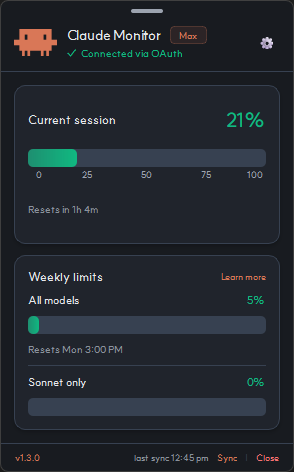
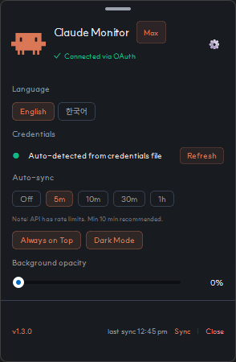

# Claude Usage Widget


> 이 프로젝트는 [INNO-HI/ClaudeUsageWidget](https://github.com/INNO-HI/ClaudeUsageWidget)의 Windows 전용 개인 포크입니다. 원작자 [@khwee2000](https://velog.io/@khwee2000)의 양해를 구하여 공개합니다. 원본 저작권은 [INNO-HI](https://github.com/INNO-HI)에 있으며, 본 포크의 변경 사항은 [Change Log](#-change-log)를, 라이선스 조건은 [LICENSE](LICENSE)를 참고하세요.

Claude Usage Widget은 바탕화면 한 구석에 띄워두고 Anthropic Claude API의 사용량을 실시간으로 확인할 수 있는 데스크탑 위젯입니다. 브라우저나 콘솔에 접속할 필요 없이 화면에서 바로 현재 세션과 주간 한도를 볼 수 있습니다.

---

## ✨ Features

- 실시간 모니터링 — 현재 세션과 주간 사용량(All Models / Sonnet)을 퍼센트로 표시
- 풀 모드 / 미니 모드 — 카드 기반 풀 모드와 아이콘 + 퍼센트만 보이는 미니 모드. 헤더의 Claude 아이콘 클릭으로 상호 전환
- 글래스모피즘 디자인 — Windows 환경에 어울리는 무테 위젯, 다크/라이트 모드 지원
- 자유로운 위치·크기 조절 — 상단 바 드래그로 이동, 모서리/가장자리 드래그로 리사이즈, 더블클릭으로 즉시 숨김
- 시스템 트레이 상주 — 위젯을 닫아도 트레이에서 백그라운드 동작
- 옵션 패널 — 언어, 인증, 자동 동기화, 항상 위, 다크 모드, 투명도, 업데이트 확인을 한 곳에서 관리
- 한국어/영어 즉시 전환 — 모든 텍스트(요일·AM/PM 포함)가 동적으로 재번역
- SUIT SemiBold 폰트 번들 — 깔끔한 한글 가독성
- API 호출 안정성 — 시작 시 0–2초 랜덤 지연, 매 sync 주기마다 ±10% jitter, 429 응답 시 지수 백오프(2× → 16× 상한)
- 자동 업데이트 — 옵션 패널의 업데이트 확인 버튼으로 새 버전을 받아 자동 재시작
- 자동 인증 — `~/.claude/.credentials.json`을 자동 감지하여 별도 로그인이 필요 없음

---

## 🚀 Installation & Usage

1. 다운로드 — [Releases](../../releases) 탭에서 최신 `Claude-Widget.exe`를 받습니다.
2. 실행 — `Claude-Widget.exe`를 더블클릭합니다. 실행에는 PC에 [Claude Code](https://docs.anthropic.com/en/docs/agents-and-tools/claude-code/overview)가 1회 이상 로그인된 인증 정보(`~/.claude/.credentials.json`)가 필요합니다.
3. 조작
   - 풀 ↔ 미니 전환 — 헤더 또는 미니뷰의 Claude 아이콘 클릭
   - 이동 — 상단 회색 바 드래그
   - 리사이즈 — 창 모서리/가장자리 드래그
   - 숨기기 — 상단 바 더블클릭 또는 푸터의 `닫기`
   - 완전 종료 — 시스템 트레이 우클릭 → `프로그램 종료`
   - 설정 — 헤더의 ⚙ 버튼
4. 자동 동기화 — 옵션 패널의 Auto-sync에서 `Off / 5m / 10m / 30m / 1h` 중 선택합니다. 기본값은 10분입니다.

<p align="center">
  
  
  
</p>
<p align="center"><sub>풀 모드 · 옵션 패널 · 미니 모드</sub></p>

본 프로그램은 개인 오픈소스 프로젝트로 디지털 서명이 되어 있지 않아 Windows SmartScreen 경고가 표시될 수 있습니다. 악성코드가 아니므로 `추가 정보 → 실행`을 눌러 진행하시면 됩니다.

---

## 🛠️ Build from Source

Python 3.10 이상과 PyQt6로 제작되었습니다.

```bash
# 1. 저장소 클론
git clone https://github.com/gnoeynij/Claude-Usage-Widget.git
cd Claude-Usage-Widget/Source

# 2. 의존성 설치
pip install -r requirements.txt
pip install pyinstaller

# 3. (선택) SUIT SemiBold 폰트를 번들하려면
#    https://sun.fo/suit/ 에서 다운로드 후
#    SUIT-SemiBold.ttf 를 Source/assets/fonts/ 에 배치합니다.
#    번들이 없으면 시스템 SUIT → Segoe UI 순으로 폴백됩니다.

# 4. PyInstaller 빌드
python -m PyInstaller claude_widget.spec --noconfirm --clean

# 5. 산출물
# Source/dist/Claude-Widget.exe
```

---

## 📝 Change Log

### v1.3.1 (현재)
- 자동 업데이트 — 옵션 패널의 `Check for Updates` 버튼으로 새 버전 확인, 사용자 동의 시 Windows `Downloads` 폴더에 다운로드 후 자동 재시작
- 시작 시 1회 자동 버전 체크 — 위젯 실행 후 약 1.5초 뒤, `Check for Updates` 버튼 옆에 `✓ 최신 버전` 또는 `● 새 버전 vX.Y.Z`가 표시됩니다 (네트워크 오류 시 무표시)
- 다운로드 시작 시 Downloads 폴더 자동 열기 — 다운로드 진행을 Explorer에서 실시간 확인 가능
- 다운로드 진행률 표시, 취소 가능, 부분 파일은 `.part`로 격리 후 원자적 rename
- 항상 위 활성 시 작업표시줄 자동 숨김 — `Always on Top`이 켜져 있으면 위젯이 작업표시줄/Alt+Tab에 표시되지 않습니다 (꺼두면 평소처럼 표시)
- AOT 토글 시 위젯 위치/크기를 보존하도록 안정화
- 원작자 attribution 및 LICENSE 파일 정비

### v1.3.0
- 미니 모드 추가 — Claude 아이콘과 항목별 퍼센트만 표시하는 미니멀 뷰
- SUIT SemiBold 폰트 번들 — 별도 설치 없이 한글 렌더링 개선
- API 호출 안정성 — jitter ±10%, 시작 지연 0–2초, 429 지수 백오프 도입
- 자동 동기화 옵션을 콘텐츠 영역에서 옵션 패널로 이동
- 주간 reset 시각의 한국어 표기 자연화
- 헤더 status 텍스트 자동 줄바꿈
- 미니 모드 미연결 시 0% 표시 (이전 `--`)
- 풀 모드 최소 크기 합리화 (280×450)
- 리사이즈 성능 최적화 — quantized scale 0.05 step + 아이콘 캐싱
- 버전 색상 가시성 개선
- 코드 리팩토링

### v1.2.0
- 위젯 크기 조절을 설정 슬라이더에서 창 모서리/가장자리 드래그 방식으로 전환
- 모서리 리사이즈 시 커서 힌트 추가
- 카드/텍스트/진행바가 창 폭에 맞춰 반응형으로 스케일되도록 개선
- 배경 투명도 동작 정비 (0% 불투명, 100% 투명)
- 투명도 100% 설정 시 마우스 클릭이 통과되는 현상 수정
- 현재 세션 진행바의 눈금 숫자 잘림 수정
- 설정 패널 토글 닫힘 시 위젯 높이 복원 수정
- 프레임리스 리사이즈 안정화 및 실행 크래시 개선

### v1.1.0
- 창 모서리 투명 여백 제거
- 푸터 버튼 역할을 `종료`에서 백그라운드로 전환되는 `닫기`로 분리
- 시스템 트레이 메뉴의 `설정`을 걷어내고 위젯 상단 ⚙ 버튼으로 일원화
- 시스템 트레이의 `프로그램 종료` 분리
- 공식 한글 도움말 링크 업데이트
- 배포용(`Release`)과 소스용(`Source`) 디렉토리 분리
- 쓰레드 메모리 정리 및 API Handshake 지연 방지 세션 객체 패치

---

## 📄 License

이 프로젝트는 [MIT License](LICENSE)를 따릅니다.

- 원본 저작권 © 2026 [INNO-HI](https://github.com/INNO-HI/ClaudeUsageWidget) — Original work
- 수정·추가 저작권 © 2026 choi jinyeong — Modifications and additional features

원작자에게 사전 양해를 구하고 공개되었습니다. MIT 라이선스의 저작권 고지 보존 조건에 따라 본 포크의 사용, 수정, 재배포가 자유롭습니다.

폰트: [SUIT](https://sun.fo/suit/) by Sun (SIL Open Font License)
